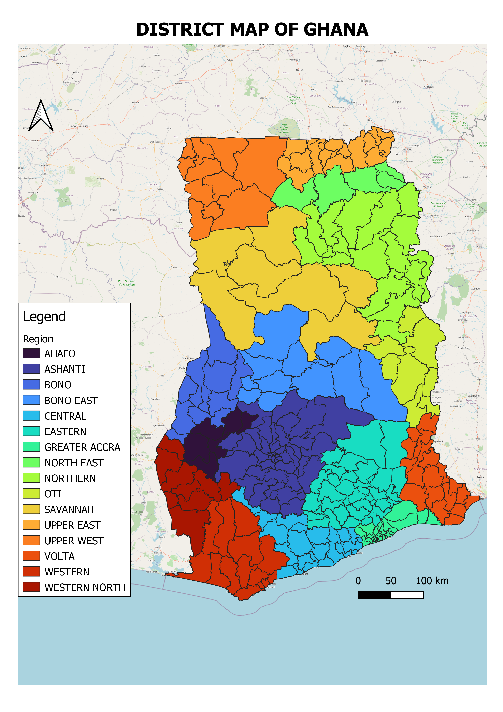
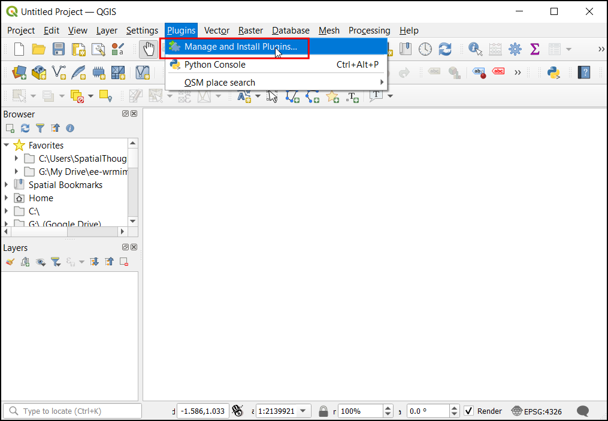
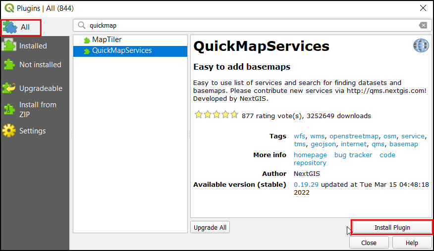
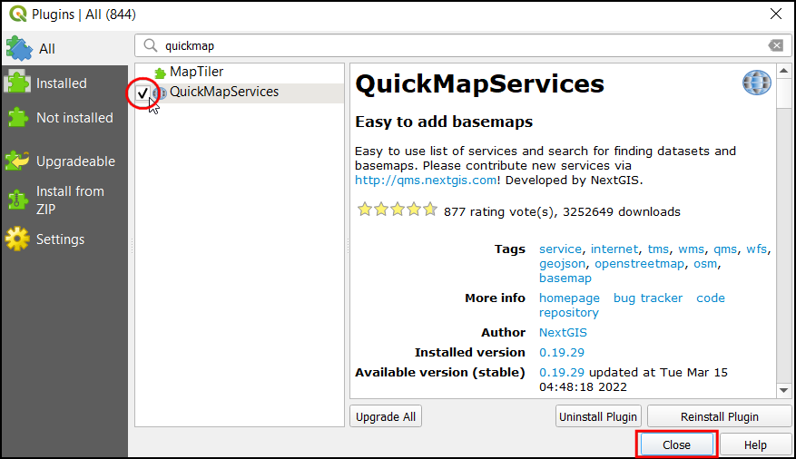
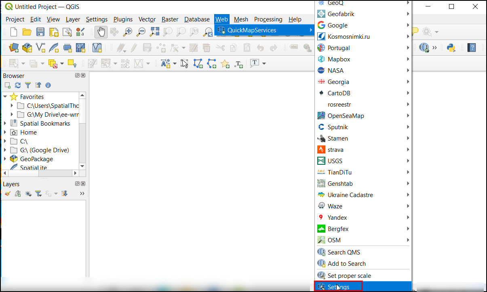
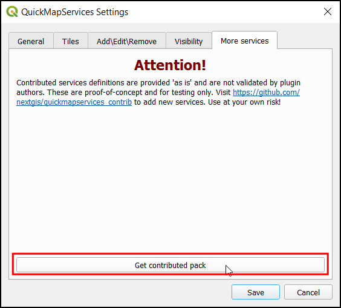
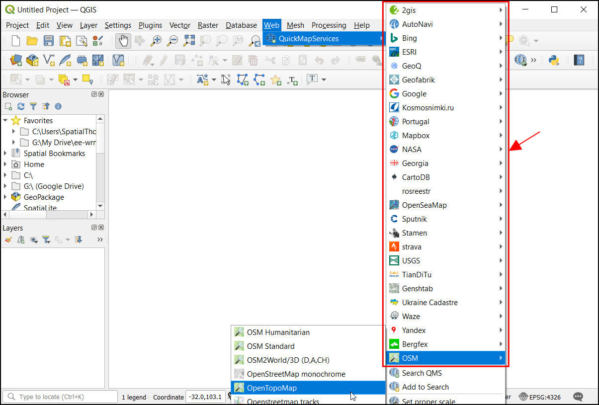
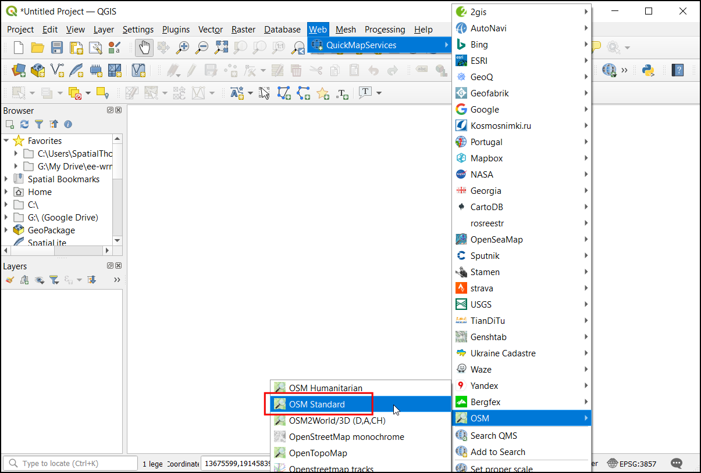
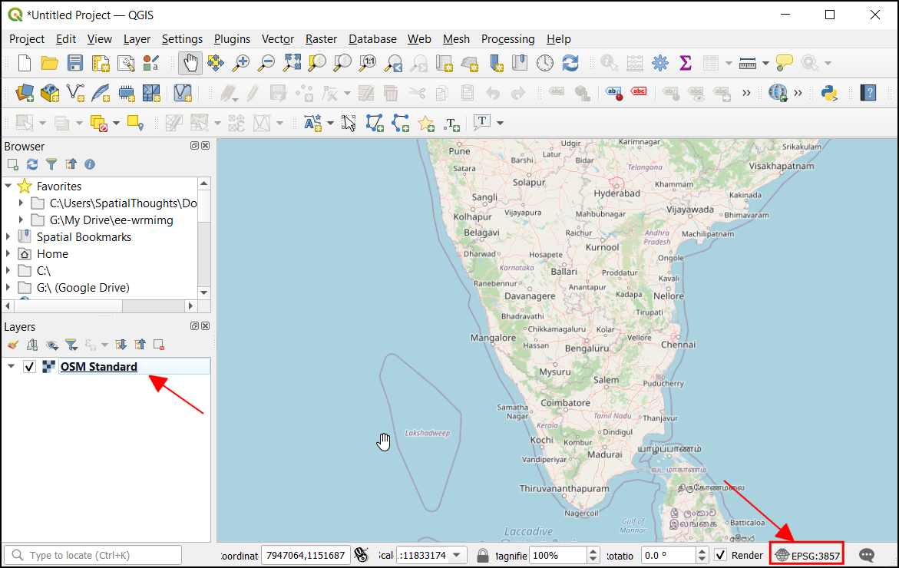

##  Creating Maps  (Hands on Exercise)

This section is designed to apply symbology, adding labels, and designing layouts for maps.  We will compose a simple map like the image below.

   

## Print Layout (Hands on Exercise)
QGIS comes with a rich set of tools to create map layouts that allow you to add elements such as labels, images, legend, scale bar, north arrow, etc., to your map. It also allows you to export the map layout as an image or a PDF. We will now use  the visualization created in the previous exercise and create a print layout. 1. Go to Project → New Print Layout….

   

## Using Basemaps
1. Open QGIS. We will use a plugin called QuickMapServices to load a basemap. From the Plugins menu choose Manage and Install Plugins

   

2. The Plugins dialog contains all the available plugins in QGIS. Under the All tab, search for quickmapservices. It has different basemaps that can be used based on your purpose. Click on the Install Plugin, to add this plugin to QGIS.

   

3. Once installed, check the box next to the QuickMapServices label to enable it. Click Close.

   

4. Now you will see a new Web menu added to the menu-bar. Go to Web → QuickMapServices menu. You will see some map providers and available basemaps. We can enable a few more providers to have many more options. Click on the Web → QuickMapServices → Settings.

   

5. In the Settings dialog, switch to the More services tab. Click on the Get contributed pack to download 3rd-party basemaps.
You will see a warning against using contributed services. Some of these services may have restrictions on their usage and/or attribution requirement that you need to follow. Please review them before using them in your project.

   

6. Once the new services are added, you will see many more options in the Web → QuickMapServices menu.

   

7. For our current task, we will use a basemap based on OpenStreetMap data. Since we need to locate the features in the scanned maps let’s add the OSM Standard. Click on the Web → QuickMapServices → OSM → OSM Standard.

   

8. Now in the canvas, the basemap will be loaded. This map is georeferenced and projected in EPSG:3857 CRS. This information can be viewed on the bottom-right of the QGIS, where the project CRS will be updated.

   

## Exercise
Load the Google Hybrid basemap by Google. 

[<<< Previous](../module1_README.md)  | [Next >>>](qis2web.md)  

