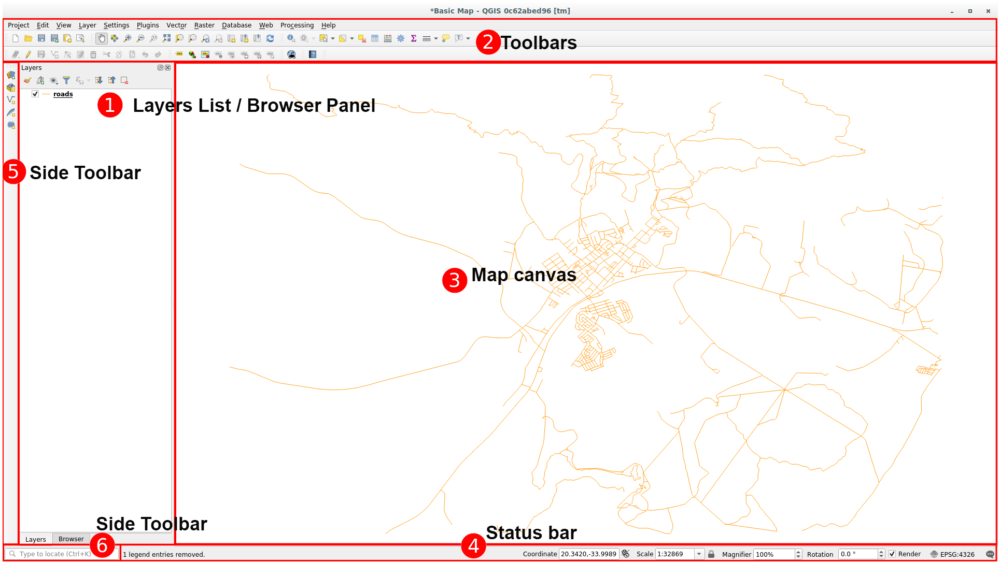
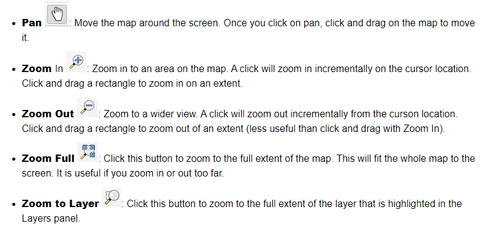
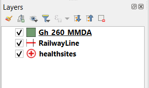

## Introduction to QGIS 

QGIS is a popular open-source GIS with advanced capabilities.It can be used to view geographic data, as well as register, modify and delete data.The project started in 2002. It has more than 35 developers and an estimated 300.000 users around the world today.

### An Overview of the Interface

   
 

### Customizing  the Interface

   

###  Map Navigation 

Tools on the Map Navigation Toolbar (see image below) and your mouse wheel are used to zoom and move around the map.

   
 

Scrolling with a mouse will zoom in and out on the map. If you click and hold the mouse wheel and drag while the wheel is depressed you will pan the map.

In addition to the mouse wheel, you can use these basic tools from the Map Navigation Toolbar to navigate the map.

## 2. GIS Datasets

- The table below lists the GIS datasets used for this tutorial.
- They can be found within the downloaded _zip_ folder from the previous
  section at `Geospatial_Developers -> datasets`.

| ID | File Name                        | Data Format | Type    | Description                     |
|----|----------------------------------|-------------|---------|---------------------------------|
| 1  | Gh_260_MMDA.shp                  | vector      | polygon | Districts of Ghana              |
| 2  | 16_Regions.shp                   | vector      | line    | Regions of Ghana                |
| 3  | population_gha_2018-10-01.tif    | raster      | tiff    | Population of Ghana in 2018     |
| 4  | healthsites.shp                  | vector      | point   | Health facilities in Ghana      |
| 4  | all_data.shp                     | vector      |geopackage|Geopackage                      |

### Adding layers to the Map

The Data Source Manager dialog allows you to choose the data to load depending on the data type. We’ll use it to load our dataset: click the dataSourceManager Open Data Source Manager button.

If you can’t find the icon, check that the Data Source Manager toolbar is enabled in the View ► Toolbars menu.

#### Loading vector data (shapefile)

   
 

### Try Yourself (Exercise)
Repeat the steps above to add the Gh_260_MMDA.shp and PointOfInterest.shp layers from the  folder (datasets\Districts of Ghana) and (datasets\Point of Interest in Ghana) respectively to the map.

#### Loading vector data from a GeoPackage Database
Databases allow you to store a large volume of associated data in one file. You may already be familiar with a database management system (DBMS) such  MS Access. 

The GeoPackage open format is a container that allows you to store GIS data (layers) in a single file. Unlike the ESRI Shapefile format (e.g. the region.shp dataset we loaded earlier), a single GeoPackage file can contain various data (both vector and raster data) in different coordinate reference systems, as well as tables without spatial information; all these features allow you to share data easily and avoid file duplication.

   
 

## Reordering the Layers
The layers in your Layers list are drawn on the map in a certain order. The layer at the bottom of the list is drawn first, and the layer at the top is drawn last. By changing the order that they are shown on the list, you can change the order they are drawn in.

The order in which the layers have been loaded into the map is probably not logical at this stage. It’s possible that the road layer is completely hidden because other layers are on top of it.

For example, this layer order

   
 

This would result in RailwayLine and healthsites being hidden as they run underneath the polygons of the Gh_260_MMDA.

To resolve this problem:

Click and drag on a layer in the Layers list.

Reorder them to look like this:

   
 

[<<< Previous](../README.md)  | [Next >>>](Cartography_and_Visualization/Cartography_and_Visualization.md)  

