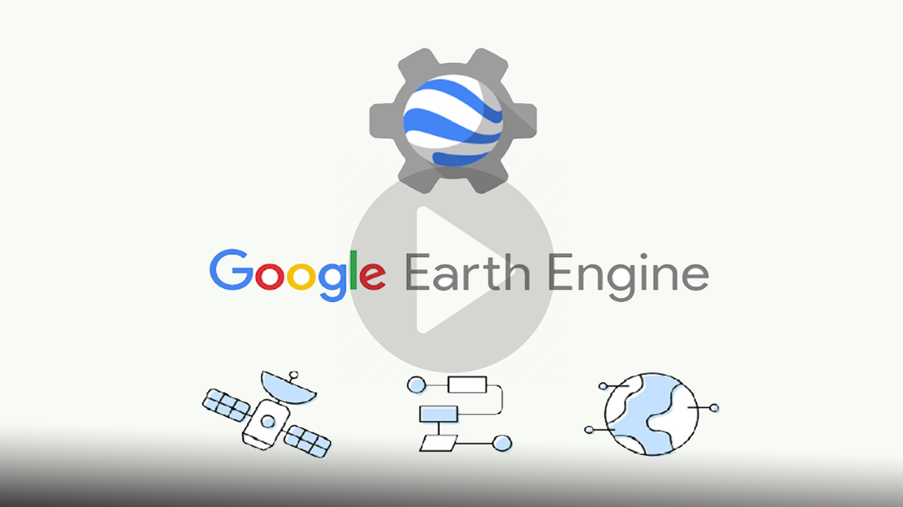

# Welcome to Google Earth Engine Training 

## Introduction

Google Earth Engine is a cloud-based platform that enables large-scale processing of satellite imagery to detect changes, map trends, and quantify differences on the Earth’s surface. This course covers the full range of topics in Earth Engine to give the participants practical skills to master the platform and implement their remote sensing projects.

 

## Objectives

The main objective is to train GIS and Remote Sensing Experts  in the basics of satellite image
processing in the [Google Earth Engine (GEE)](https://earthengine.google.com/) Environment by leveraging on the Google Earth
high-resolution imagery and the GEE cloud-based data processing capacities for land use
mapping, spatiotemporal analysis on forest monitoring and cartographic visualization.

#### [Basics to Earth Engine and Github](training/modules/module1.md)
- Overview of GEE
- Introduction to JavaScript
- GEE objects, strings, lists, Arrays
- Hands-on exercises

#### [ImageCollections and FeatureCollections](training/modules/module2.md)
- Introduction to the concept of image and feature collections in GEE
- Filtering, reducing, mosaicking, cloud masking, clipping and working with image 
collections
- Accessing and displaying satellite imagery through the GEE Code Editor
- Asset management (importing and exporting data)
- Hands-on exercises

#### [Exploring Spatial Indices in GEE](training/modules/module3.md)
- Exploring spectral indices (NDVI, NDBI, LSWI)
- Stacking spectral indices and spectral bands

#### [Random Forest Image Classification in GEE](training/modules/module5.md)
- Introduction to Machine Learning and Classification in GEE 
- Supervised classification in GEE
- Accuracy assessment in GEE
- Map generation in QGIS
- Hands-on exercise

